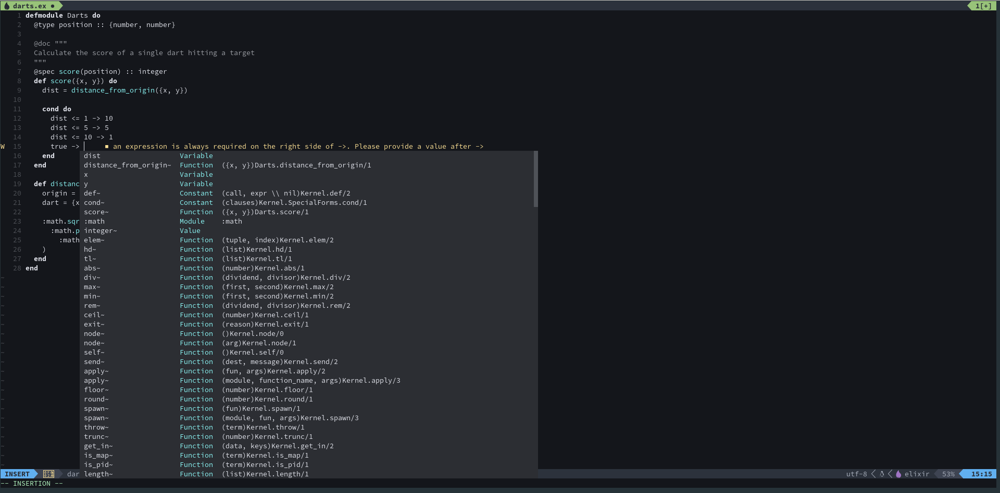

# NEOVIM CONFIG

## Setup

Extract this in `~/.config/nvim/` as `git clone git@github.com:trodix/nvim-conf.git .`

### Pluggins (vim-plug)

- mason-lspconfig
- elixis-ls
- treesitter
- nvim-cmp
- conform
- telescope
- lualine
- vim-gitgutter

### Shortcuts

|  KeyBinding   |                                        |
|---------------|----------------------------------------|
| Ctrl + e      | Search files                           |
| Ctrl + f      | Search text in files                   |
| u             | Undo                                   |
| Ctrl + r      | Redo                                   |
| dd            | Cut 1 line                             |
| dd5           | Cut 5 lines                            |
| yy            | Copy 1 line                            |
| yy5           | Copy 5 lines                           |
| p             | Paste (before cursor)                  |
| Ctrl + z      | Send nvim to the background            |
| fg            | Retrieve backgroud session             |
| Ctrl + Left   | Navigate to prev tab                   |
| Ctrl + Right  | Navigate to next tab                   |

### Combo keys

**Comment lines: ** `Ctrl + v` in default mode to enter in visual mode then `Down` to select lines then `Shift + i` to enter insert mode then `#` or `//` on the current line then `Esc` to apply to all selected lines

